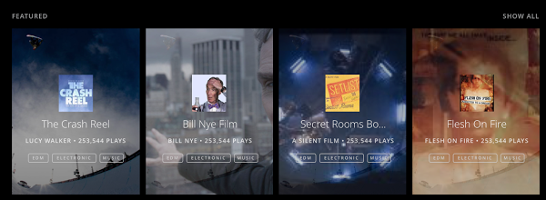

# bitTorrentChallenge

1) Bundle API docs here: https://github.com/bittorrent/content-bundles-api

2) Bundle site here: http://bundles.bittorrent.com/

3) Single page web view of the design below.
When a user clicks on one of the tiles, it should navigate to the Bundle's page.
When the user clicks on a tag, it should navigate to the tag search results. (The tags which are actually associated with the Bundles, not the placeholders in the image.)
Ignore "Show All" and the play counts.
Page has graceful loading states.

## Link to Challenge: Vrturo.io/BitTorrentChallenge
